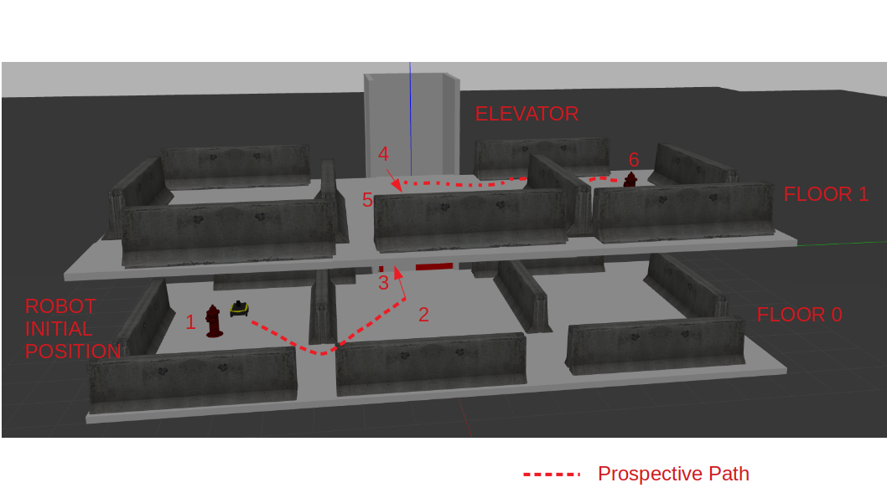

# Robot Multi Floor Navigation Package

This package enables the Clearpath Jackal robot to autonomously navigate through a multi-floor environment using an elevator. It utilizes Robot Operating System (ROS) and Gazebo simulation for development and testing.

## Functionality
- Navigation to goal points
- Getting in and out of elevator
- Switching maps for appropriate floors automatically
- Localize after map switching

## Simulation scenario
Navigate Clearpath Jackal autonomously through a series of waypoints to starting from floor 0 and ending at floor 1, by navigating through obstacles and using the elevator in the [provided simulation world](https://bitbucket.org/swaroophs/jackal_elevator/src/master/).



Here, the numbers denote the waypoints as follows:

1. Near fire hydrant floor 0: `(4.0,-5.0,0.5)`
2. In front of elevator floor 0: `(3.0,-0.5,0.5)`
3. Inside elevator floor 0: `(0.0,-0.5,0.5)`
4. Inside elevator floor 1: `(0.0,-0.5,3.2)`
5. In front of elevator floor 1: `(3.0,-0.5,3.2)`
6. Near fire hydrant floor 1: `(4.0,5.0,3.2)`

## Install

### Get dependencies
Ensure you have the following ROS packages installed:

Jackal Gazebo Dependencies:

If using ROS melodic, run:

```
$ sudo apt-get install ros-melodic-jackal-*
```

### ROS Workspace Setup (Melodic)

1. Create a ROS workspace:
```bash
$ mkdir -p ~/catkin_ws/src
$ cd ~/catkin_ws/src
```

2. Clone this repository and the jackal elevator world repository:
```bash
$ git clone https://github.com/weijieyong/robot-multi-floor-navigation.git # for multi floor navigation
$ git clone https://bitbucket.org/swaroophs/jackal_elevator.git # for gazebo world
```

3. Build the workspace:
```bash
$ cd ~/catkin_ws/
$ catkin_make
$ source ~/catkin_ws/devel/setup.bash
```

## Mapping
This package utilizes the `gmapping` package for generating maps within the simulation.

1. Launch the gmapping node.
```bash
roslaunch multi_floor_navigation jackal_elevator_gmapping.launch
```

2. Use the `Interaction Marker` in RViz to move the robot and generate a map.

3. Save the map for floor 0 using:
```bash
$ rosrun map_server map_saver -f <map_filename>.yaml
```

4. Edit the z_pos parameter in [jackal_elevator_gmapping.launch](./multi_floor_navigation/launch/jackal_elevator_gmapping.launch) and repeat steps 1-3 to save a map for floor 1.


***Note**: Pre-generated maps for both floors are already available in the maps folder.*


## Navigation

1. Start the navigation nodes.
```bash
roslaunch multi_floor_navigation jackal_elevator_nav.launch
```

2. Once the simulation is launched, run the following node to start navigating.
```bash
rosrun multi_floor_navigation multi_floor_navigation_node
```

The robot will then begin navigating between floors according to the defined waypoints.